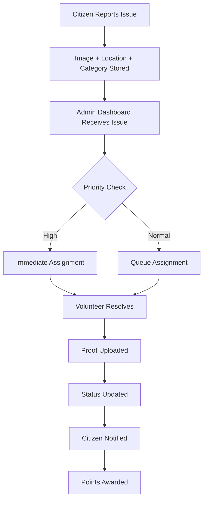

#  JanSevak 
https://jansevak1.onrender.com/

##  Overview

JanSevak is a next-generation civic issue management platform designed to bridge the gap between citizens, volunteers, NGOs, and administrative authorities. The platform transforms the traditional complaint system into a transparent, trackable, and action-oriented digital ecosystem.

Instead of complaints getting ignored in files, emails, or offline processes, JanSevak ensures every reported issue is visible, prioritized, assigned, tracked, and resolved efficiently.

This platform is built with a strong focus on:
- Transparency
- Speed of resolution
- Community participation
- Smart governance
- Real-time monitoring
- Reward-based engagement

---

## Project Structure

```bash
JANSEVAK/
├── backend/
│   ├── config/
│   ├── controllers/
│   ├── models/
│   ├── routes/
│   ├── scripts/
│   ├── sockets/
│   ├── .env
│   ├── package.json
│   └── server.js
│
├── frontend/
│   ├── public/
│   ├── src/
│   │   ├── assets/
│   │   ├── Components/
│   │   ├── context/
│   │   ├── pages/
│   │   │   ├── admin-dashboard/
│   │   │   └── user-dashboard/
│   │   ├── App.jsx
│   │   └── main.jsx
│   ├── package.json
│   └── vite.config.js
│
└── README.md
```


##  Real World Problem Statement

In cities, campuses, and communities, thousands of civic issues arise every day:

- Garbage overflow in public places
- Broken street lights
- Water leakage
- Road damage / potholes
- Electricity faults
- Drainage blockage
- Sanitation issues
- Unsafe public zones
- Infrastructure maintenance complaints

## Current Complaint Systems Fail Because:

Manual Reporting
  
  - Most complaints are still submitted physically or through unorganized channels.

No Tracking System
   
  - Users do not know whether action is taken or not.

Delayed Resolution
    
  - No workflow automation leads to slow action.

Lack of Accountability
  
  - No clear ownership of complaints.

Poor Citizen Participation
  
   - People stop reporting because nothing changes.


#  Our Solution – JanSevak

JanSevak creates one connected ecosystem where all stakeholders work together.

### Core Flow:

. Citizen reports issue instantly  
. System stores complaint with location & category  
. Admin sees complaint live on dashboard  
. Volunteer gets assigned nearby task  
. Volunteer resolves issue  
. Status updates in real-time  
. Citizen earns points and trust increases  

---

#  Vision

To build smarter, cleaner, and more responsive communities using technology, data, and citizen participation.

---

# User Roles / Portals

JanSevak is a multi-role platform where each user has a dedicated dashboard, tools, and responsibilities.  
It creates a complete ecosystem where issues are reported, managed, and resolved efficiently.

The platform connects three major roles:

- Citizens  
- Volunteers  
- Admins / NGOs  

---

# 1. Citizen Portal

The Citizen Portal allows users to report civic problems and track progress transparently.

## Purpose
To give every citizen an easy digital channel to raise complaints.

## Key Features

### Issue Reporting
Users can submit complaints with:
- Image / video proof
- Title
- Description
- Category
- Exact location

### Auto GPS Location
Automatically captures issue location.

### Categories
Examples:
- Garbage
- Roads
- Water Leakage
- Electricity
- Drainage
- Cleanliness
- Infrastructure

### Live Status Tracking
Users can track complaint stages:

- Submitted
- Under Review
- Assigned
- In Progress
- Resolved

### Complaint History
Stores all previous reports in dashboard.

### Upvote & Comments
Users can support important issues and share feedback.

### Rewards System
Points are earned for valid reporting and engagement.

### Profile & Settings
Manage account details and preferences.

---

# 2. Volunteer Portal

The Volunteer Portal is for students, NGOs, and helpers who want to solve issues actively.

## Purpose
To turn community participation into real action.

## Key Features

### Nearby Issues
View nearby pending complaints.

### Smart Recommendations
Tasks suggested based on:
- Skills
- Availability
- Distance

### Task Acceptance
Volunteers can accept and work on tasks.

### Completion Proof
Upload photos and notes after task completion.

### Leaderboard
Top contributors ranked by activity.

### Badges
Examples:
- First Responder
- City Hero
- Top Volunteer

### Performance Analytics
Track:
- Tasks completed
- Hours contributed
- Rewards earned

---

# 3. Admin / NGO Portal

The Admin Portal is the control center for management and decision-making.

## Purpose
To ensure accountability and faster issue resolution.

## Key Features

### Live Monitoring
Track all complaints in one dashboard.

### Heatmap Analysis
Identify problem hotspots.

### Volunteer Management
- Add volunteers
- Assign tasks
- Track performance

### Category Management
Create and update issue categories.

### Priority Escalation
Critical issues get urgent attention.

### Analytics
View:
- Total issues
- Pending issues
- Resolved issues
- Common complaint types
- Area-wise reports

### Announcements
Send alerts, notices, and updates.

### Secure Access
Only authorized admins can access controls.

---

# Why Multi-Role System Matters

Traditional systems only collect complaints.  
JanSevak creates a full workflow:

Citizen Reports → Admin Manages → Volunteer Resolves → Citizen Updated

Benefits:

- Faster action  
- Better accountability  
- Higher engagement  
- Real-time transparency  
- Scalable governance model

---

# Installation Guide

## Clone Repository

```bash
git clone https://github.com/yourusername/jansevak.git
cd JANSEVAK
```

## Frontend Setup

```bash
cd frontend
npm install
npm run dev
```

## Backend Setup

```bash
cd backend
npm install
npm run dev
```

# Full Workflow



---

## Team Name

 codersx

 ## Team Authors

- **Anushka Mahajan**
- **Iksha Malhotra**
- **Aditya Singh**
- **Tejasvi Sharma**
- **Kinjal Gupta**

---

# Final Statement

JanSevak is not just a project.  
It is a step toward transparent, collaborative, and smart governance.

> **Smart Citizens + Smart Governance = Better Communities**
